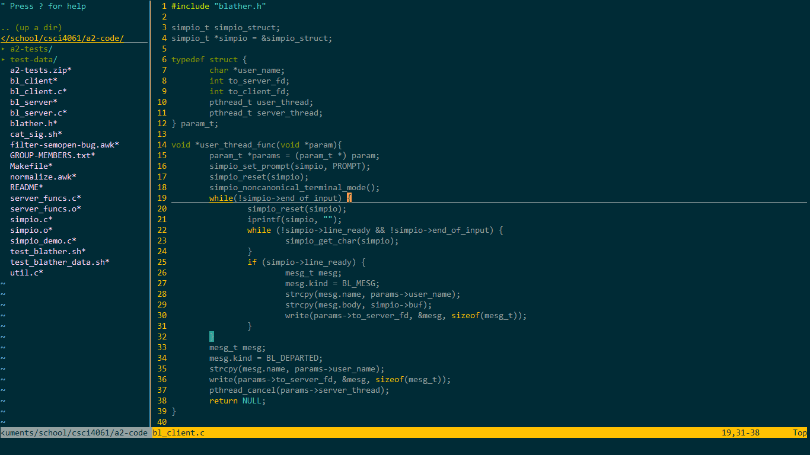

# configs
My .vimrc, .bashrc, and wsltty theme.

Save to ~/ folder (with the exception of the wsltty themes). Requires [WSLtty](https://github.com/mintty/wsltty) and [Vundle](https://github.com/VundleVim/Vundle.vim). Type vim +PluginInstall +qall to install vim plugins.

Make sure to fill in 'username' placeholders.

## demo

